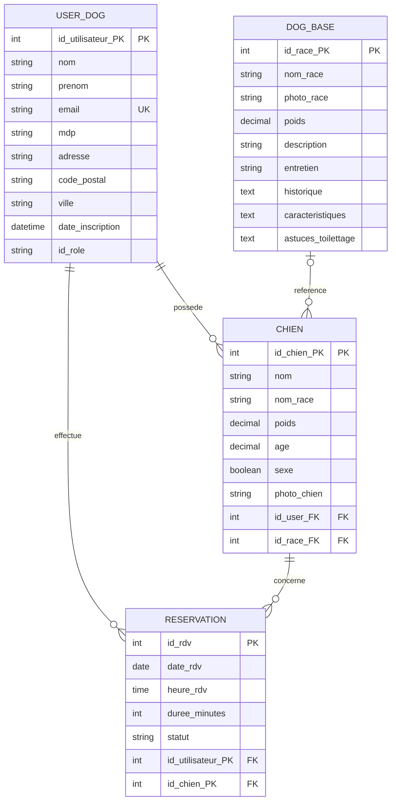
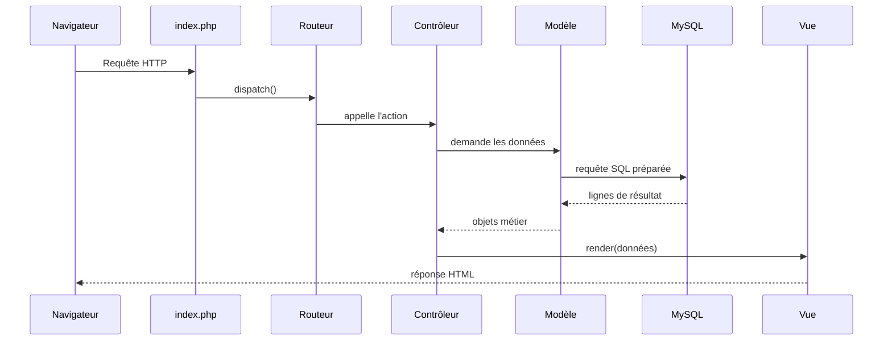

# Dossier de réalisation - Atelier du Museau

## Introduction

Dans le cadre de ma formation de **Développeur Web et Web Mobile (DWWM)**, j'ai choisi de réaliser un projet directement lié à un besoin réel : la création du site internet de l'activité de toilettage canin de ma femme, **Atelier du Museau**.

Ma femme débute son activité de salon de toilettage et avait besoin d'une présence en ligne claire, professionnelle et facile à utiliser. Le site devait lui permettre de présenter ses services, ses tarifs et les races qu'elle peut toiletter, tout en donnant aux clients la possibilité de créer un compte, d'enregistrer leur chien et de demander un rendez-vous en ligne. L'espace d'administration lui permet également de suivre les demandes et de gérer les informations utiles à son activité.

Ce projet répond donc à une situation concrète, avec des utilisateurs et des contraintes identifiés. Il m'a permis de mettre en pratique les compétences abordées pendant la formation : analyse du besoin, conception des données, création d'une interface responsive, développement en PHP orienté objet selon une architecture MVC, gestion des formulaires, authentification, sécurisation des données et déploiement sur un hébergement en ligne.

Au-delà de l'exercice technique, ce site constitue un outil destiné à accompagner le lancement de son activité. Ce dossier présente les choix réalisés, les fonctionnalités développées, les difficultés rencontrées et les pistes d'amélioration envisagées.

## Sommaire

1. Présentation du projet
2. De la demande au wireframe Figma
3. Définition des besoins
4. Choix techniques
5. Conception de la base de données
6. Préparation de l'environnement local
7. Organisation du projet avec l'architecture MVC
8. Fonctionnement d'une requête de A à Z
9. Développement des fonctionnalités publiques
10. Développement de l'espace utilisateur
11. Développement de la réservation
12. Développement de l'administration
13. Gestion des images
14. Mise en forme et responsive design
15. Sécurité de l'application
16. Tests et recette
17. Déploiement
18. Difficultés, évolutions et améliorations possibles
19. Conclusion
20. Trame courte pour la présentation orale

---

## 1. Présentation du projet

### 1.1 Contexte

**Atelier du Museau** est un site web pour une activité de toilettage canin. Le site possède deux objectifs principaux :

- présenter l'entreprise, ses services, ses tarifs et les races toilettées ;
- permettre aux clients de créer un compte, d'enregistrer leurs chiens et de prendre rendez-vous en ligne.

Une interface d'administration permet ensuite au responsable de consulter les données du site et de gérer les réservations, les utilisateurs, les chiens et le référentiel des races.

### 1.2 Utilisateurs visés

Trois types de visiteurs ont été pris en compte :

| Profil | Besoin principal | Accès |
|---|---|---|
| Visiteur | Découvrir l'activité, les tarifs et les races | Pages publiques |
| Client connecté | Gérer ses chiens et ses rendez-vous | Espace personnel |
| Administrateur | Superviser et administrer le site | Tableau de bord protégé |

### 1.3 Fonctionnalités livrées

- page d'accueil et page de tarifs ;
- catalogue public des races et fiche détaillée de chaque race ;
- inscription, connexion et déconnexion ;
- profil client ;
- ajout d'un chien avec photo facultative ;
- création et annulation d'une réservation ;
- suivi du statut d'un rendez-vous ;
- tableau de bord administrateur avec statistiques ;
- gestion des utilisateurs, chiens, races et réservations ;
- affichage adapté aux écrans d'ordinateur et aux appareils mobiles.

### 1.4 Moyens humains et techniques

**Moyens humains**

| Rôle | Personne | Contribution |
|---|---|---|
| Développeur | Moi-même, apprenti DWWM | Analyse du besoin, conception, développement, tests et déploiement |
| Commanditaire / cliente | Ma femme, toiletteuse canin | Expression du besoin, validation des maquettes et retours d'utilisation réelle |
| Formateur / jury | Centre de formation | Suivi pédagogique et évaluation du projet |

Le projet a été mené en solo sur toute la chaîne de réalisation, de la conception à la mise en production, avec des points réguliers auprès de la commanditaire pour valider les choix fonctionnels et ergonomiques.

**Moyens techniques**

| Catégorie | Outils / matériel utilisés |
|---|---|
| Poste de développement | Ordinateur personnel, éditeur VS Code |
| Environnement local | MAMP (Apache, MySQL, PHP), phpMyAdmin |
| Conception | Figma pour les wireframes et le prototype |
| Versionnement | Git et dépôt distant pour le suivi des versions du code |
| Langages et technologies | HTML5, CSS3, JavaScript, PHP orienté objet, SQL |
| Base de données | MySQL |
| Emails transactionnels | PHPMailer, relais SMTP Brevo |
| Hébergement | OVH (serveur web et base de données de production) |

Ces moyens sont volontairement simples et accessibles, cohérents avec un projet de fin de formation mené par une seule personne, sans budget dédié à des outils payants supplémentaires.

---

## 2. De la demande au wireframe Figma

### 2.1 Pourquoi commencer par un wireframe ?

Un **wireframe** est une maquette simplifiée d'une page. Il montre la position des éléments sans obliger à finaliser immédiatement les couleurs, les images ou les détails graphiques.

Cette étape évite de commencer directement par le code. Elle permet d'abord de répondre à des questions simples :

- quelles pages faut-il créer ?
- que doit voir l'utilisateur en premier ?
- où placer la navigation ?
- quel bouton représente l'action principale ?
- comment passer d'une page à une autre ?

### 2.2 Étapes réalisées dans Figma

Le travail de conception peut être présenté dans cet ordre :

1. Création d'une page Figma dédiée au projet.
2. Création de frames aux dimensions ordinateur et mobile.
3. Placement des zones principales : en-tête, navigation, contenu et pied de page.
4. Conception de la page d'accueil avec une accroche, les services et un bouton de réservation.
5. Conception des formulaires d'inscription, de connexion, d'ajout d'un chien et de réservation.
6. Conception de l'espace personnel affichant les chiens et les rendez-vous du client.
7. Conception du tableau de bord administrateur et de ses tableaux de gestion.
8. Création d'un prototype reliant les boutons aux différents écrans.
9. Vérification de la cohérence des composants : boutons, cartes, champs, tableaux et messages.
10. Déclinaison mobile avec un menu compact et des contenus réorganisés verticalement.

> **À ajouter avant le rendu :** insérer ici le lien vers le fichier Figma et 3 à 5 captures, par exemple le wireframe de l'accueil, le profil, la réservation, le tableau de bord et une vue mobile. Les fichiers du projet ne contiennent pas le lien Figma ; il ne faut donc pas en inventer un.

### 2.3 Du wireframe à l'interface finale

Chaque bloc de la maquette a ensuite été traduit en HTML et en CSS :

| Élément de la maquette | Traduction dans le site |
|---|---|
| Barre de navigation | Élément `<nav>` du gabarit principal |
| Zone d'introduction | Section `.hero` de la page d'accueil |
| Cartes de services | Grille `.services-grid` |
| Cartes de races | Grille `.breeds-grid` |
| Formulaires | Balises `<form>`, `<label>`, `<input>` et `<select>` |
| Espace administrateur | Mise en page `.admin-layout` avec barre latérale |
| Adaptation mobile | Media queries du fichier CSS et menu burger |

Le wireframe décrit donc **ce que l'utilisateur voit**, tandis que le développement ajoute **ce que le site fait** : contrôles, connexion à la base, authentification et enregistrement des données.

---

## 3. Définition des besoins

### 3.1 Parcours visiteur

Un visiteur doit pouvoir :

1. arriver sur la page d'accueil ;
2. comprendre l'activité proposée ;
3. consulter les tarifs ;
4. parcourir les races toilettées ;
5. ouvrir une fiche de race ;
6. créer un compte ou se connecter pour réserver.

### 3.2 Parcours client

Un client doit pouvoir :

1. créer un compte avec son nom, son prénom, son adresse électronique, son adresse postale d'intervention et un mot de passe ;
2. se connecter ;
3. accéder à son profil et modifier son adresse d'intervention ;
4. ajouter un ou plusieurs chiens ;
5. modifier les informations de ses chiens depuis son profil ;
6. choisir l'un de ses chiens lors d'une réservation ;
7. choisir une date future et un créneau parmi ceux proposés le matin ou l'après-midi ;
8. consulter l'état de ses rendez-vous ;
9. annuler une réservation encore en attente ;
10. se déconnecter.

### 3.3 Parcours administrateur

L'administrateur doit pouvoir :

1. se connecter avec un compte possédant le rôle `admin` ;
2. consulter les statistiques générales ;
3. afficher tous les rendez-vous ;
4. faire passer un rendez-vous à `en attente`, `confirmé`, `annulé` ou `terminé` ;
5. afficher et supprimer des utilisateurs ;
6. consulter ou supprimer des chiens ;
7. ajouter, modifier et supprimer des fiches de races.

### 3.4 Règles de gestion principales

- une adresse électronique ne peut appartenir qu'à un seul compte ;
- un client doit renseigner une adresse d'intervention (adresse, code postal, ville) dès l'inscription, modifiable ensuite depuis son profil ;
- un chien appartient à un utilisateur ;
- un chien peut être lié à une race du référentiel, mais cette liaison est facultative ;
- une réservation appartient à un utilisateur et concerne un chien ;
- la date et l'heure d'une nouvelle réservation doivent être dans le futur ;
- une réservation ne peut être prise que sur l'un des créneaux fixes du matin (08h30, 09h00, 09h30) ou de l'après-midi (13h30, 14h00, 14h30) ;
- une seule réservation active est autorisée par demi-journée (matin ou après-midi), quel que soit le client ou le créneau précis choisi, car une seule personne assure les interventions ;
- une réservation est créée avec le statut `en attente` ;
- un client ne doit voir que ses propres chiens et réservations ;
- seul un administrateur peut accéder aux pages d'administration ;
- un administrateur ne peut pas supprimer son propre compte depuis la liste des utilisateurs.

### 3.5 User stories détaillées et critères d'acceptation

Les parcours précédents décrivent les besoins généraux. Les exemples ci-dessous relient plus précisément la conception fonctionnelle aux contrôles réalisés dans l'application.

| User story | Préconditions | Règles métier | Critères d'acceptation |
|---|---|---|---|
| En tant que visiteur, je veux créer un compte afin d'accéder aux services de réservation. | Ne pas être déjà connecté. | L'email doit être valide et unique ; les deux mots de passe doivent correspondre ; l'adresse d'intervention est obligatoire. | Avec des données valides, le compte est enregistré avec le rôle `client` et le mot de passe est haché. Si l'email existe ou si les mots de passe diffèrent, aucun compte n'est créé et un message explique l'erreur. |
| En tant que client, je veux enregistrer mon chien afin de pouvoir réserver pour lui. | Être authentifié comme client. | Le chien est obligatoirement rattaché au client connecté ; la photo est facultative et doit respecter les formats autorisés. | Le chien apparaît dans le profil du client. Il n'apparaît pas dans le profil d'un autre client et ne peut pas être modifié par celui-ci. |
| En tant que client, je veux réserver un rendez-vous pour l'un de mes chiens. | Être authentifié et posséder au moins un chien. | Le chien doit appartenir au client ; la date et l'heure doivent être futures ; le créneau doit faire partie des horaires proposés ; la demi-journée doit être disponible. | Une demande valide crée une réservation au statut `en attente`. Une date passée, un chien appartenant à un tiers ou une demi-journée occupée provoque un refus sans création en base. |
| En tant que client, je veux annuler une demande encore en attente. | Être authentifié et être propriétaire de la réservation. | Seule une réservation appartenant au client et ayant le statut `en attente` peut être annulée. | Le statut devient `annulé` pour le propriétaire. La même action demandée par un autre client est refusée. |
| En tant qu'administrateur, je veux gérer les réservations afin d'organiser l'activité. | Être authentifié avec le rôle `admin`. | Le nouveau statut doit être autorisé ; une réservation annulée ne peut redevenir active si la demi-journée est déjà occupée. | Le statut est enregistré lorsqu'il respecte les règles. Un compte client est redirigé et un changement créant un conflit est refusé. |

Ces critères se retrouvent dans les contrôleurs pour la validation et les contrôles d'accès, dans les modèles pour les lectures et écritures SQL, et dans le plan de recette de la section 16. Ils permettent donc de vérifier que l'implémentation répond bien au besoin formulé au départ.

---

## 4. Choix techniques

### 4.1 Technologies utilisées

| Technologie | Rôle dans le projet |
|---|---|
| HTML5 | Structure des pages |
| CSS3 | Apparence, grilles et responsive design |
| JavaScript | Menu mobile et affichage conditionnel de certains champs |
| PHP orienté objet | Logique serveur et architecture MVC |
| MySQL | Stockage permanent des données |
| PDO | Communication sécurisée entre PHP et MySQL |
| OVH | Hébergement du site et serveur web utilisé en production |
| Figma | Wireframes et prototype de l'interface |
| phpMyAdmin | Création, import et vérification de la base |
| PHPMailer | Construction et envoi des emails par SMTP |
| Brevo | Relais SMTP utilisé pour les emails transactionnels |

### 4.2 Pourquoi PHP et MySQL ?

PHP est adapté à un site dynamique comportant des formulaires, des sessions et une base de données. MySQL permet de conserver les utilisateurs, les chiens, les races et les réservations même après la fermeture du navigateur.

Le navigateur ne doit jamais communiquer directement avec MySQL. Il envoie une requête à PHP ; PHP vérifie les données, interroge MySQL, puis renvoie une page HTML.

### 4.3 Pourquoi une base relationnelle (SQL) plutôt que NoSQL ?

Les données du projet sont fortement liées entre elles : un utilisateur possède des chiens, un chien peut être rattaché à une race, et une réservation relie un utilisateur, un chien et un créneau. Ce sont des relations structurées, avec des cardinalités précises (par exemple « un chien appartient à un seul propriétaire »), ce qui correspond exactement à ce qu'un modèle relationnel sait exprimer nativement grâce aux clés étrangères.

Une base NoSQL (par exemple orientée documents comme MongoDB) est plutôt adaptée à des données peu structurées, qui changent souvent de forme, ou qui n'ont pas besoin de garantir une cohérence stricte entre plusieurs entités. Ce n'est pas le cas ici : le projet a au contraire besoin de contraintes fortes (unicité de l'email, un chien ne peut pas exister sans propriétaire, suppression en cascade des réservations liées) que le modèle relationnel garantit directement au niveau de la base, sans avoir à réimplémenter ces vérifications manuellement dans le code PHP.

Le volume de données reste par ailleurs modeste (quelques centaines d'utilisateurs et de réservations), ce qui ne justifie pas les avantages habituels du NoSQL (répartition sur plusieurs serveurs, très gros volumes, lectures/écritures massives). MySQL, combiné à PDO, offre donc un bon compromis entre simplicité, fiabilité des données et compatibilité avec l'hébergement mutualisé OVH utilisé en production.

### 4.4 Pourquoi une architecture MVC ?

MVC signifie **Modèle - Vue - Contrôleur** :

- le **Modèle** lit et modifie la base de données ;
- la **Vue** affiche le HTML ;
- le **Contrôleur** reçoit l'action de l'utilisateur et coordonne le modèle et la vue.

Cette séparation rend le projet plus compréhensible. Par exemple, une requête SQL n'est pas placée au milieu d'une page HTML, et la présentation ne décide pas directement qui a le droit de supprimer un utilisateur.

Dans ce projet, les responsabilités sont réparties de la manière suivante :

- une **vue** affiche les informations reçues et échappe les contenus variables ; elle ne décide ni des droits d'accès ni des requêtes SQL à exécuter ;
- un **contrôleur** reçoit la requête, vérifie l'authentification, l'autorisation et les données du formulaire, puis appelle le modèle et choisit la vue ou la redirection ;
- un **modèle** regroupe l'accès aux données avec PDO et transforme les résultats SQL en objets ;
- une **entité** représente un objet métier et porte les comportements qui lui appartiennent, comme `Reservation::heureFin()` et `Reservation::isPending()`.

Cette organisation ne rend pas automatiquement le code propre : elle impose surtout une règle de responsabilité. Si une vue supprimait directement une réservation, le contrôle de propriété pourrait être oublié. Si le contrôleur construisait lui-même toutes les requêtes SQL, il deviendrait difficile à lire et à tester. Le découpage retenu limite ces mélanges tout en restant adapté à la taille du projet.

---

## 5. Conception de la base de données

Avant d'écrire la moindre ligne de SQL, il est nécessaire de représenter les données manipulées par le site et les liens qui les unissent. Cette démarche suit la méthode Merise : on part du besoin exprimé par la cliente (utilisateurs, chiens, races, réservations) pour construire un **Modèle Conceptuel de Données (MCD)**, indépendant de toute technologie, puis on le traduit en un **Modèle Logique de Données (MLD)** propre à une base relationnelle. Cette section présente les choix effectués à chaque étape, les compromis retenus et la manière dont ils se traduisent concrètement dans le script `install.sql` et dans le code PHP qui interroge la base.

### 5.1 Du besoin au MCD

Le fichier `atelierDuMuseauMCD.mcd` représente le **Modèle Conceptuel de Données**. Cette étape sert à identifier les informations importantes avant d'écrire du SQL.

Les entités métier retenues sont :

- **Utilisateur** : identité, email, mot de passe, adresse d'intervention (adresse, code postal, ville), date d'inscription et rôle ;
- **Chien** : nom, race, poids, âge, sexe et photo ;
- **Race** : nom, poids moyen, description et conseils ;
- **Réservation** : date, créneau, durée et statut.

### 5.2 Dictionnaire de données

Le tableau suivant détaille les champs de chaque table, leur type et leur rôle.

**Utilisateur (`user_dog`)**

| Champ | Type | Contrainte | Description |
|---|---|---|---|
| id_utilisateur_PK | INT | PK, AUTO_INCREMENT | Identifiant unique du compte |
| nom | VARCHAR(255) | NOT NULL | Nom de famille |
| prenom | VARCHAR(255) | NOT NULL | Prénom |
| email | VARCHAR(255) | UNIQUE, NOT NULL | Email utilisé pour la connexion |
| mdp | VARCHAR(255) | NOT NULL | Mot de passe haché |
| adresse | VARCHAR(50) | NOT NULL | Adresse d'intervention |
| code_postal | VARCHAR(50) | NOT NULL | Code postal d'intervention |
| ville | VARCHAR(50) | NOT NULL | Ville d'intervention |
| date_inscription | TIMESTAMP | DEFAULT CURRENT_TIMESTAMP | Date de création du compte |
| id_role | VARCHAR(255) | NOT NULL | Rôle du compte (`client` ou `admin`) |

**Chien (`chien`)**

| Champ | Type | Contrainte | Description |
|---|---|---|---|
| id_chien_PK | INT | PK, AUTO_INCREMENT | Identifiant unique du chien |
| nom | VARCHAR(255) | NOT NULL | Nom du chien |
| nom_race | VARCHAR(255) | NOT NULL | Nom de la race saisi librement |
| poids | DECIMAL | NOT NULL | Poids du chien en kg |
| age | DECIMAL | NOT NULL | Âge du chien en années |
| sexe | BOOLEAN | NOT NULL | Mâle ou femelle |
| photo_chien | VARCHAR(255) | NULL | Chemin de la photo du chien |
| id_user_FK | INT | FK, NOT NULL | Référence au propriétaire (`user_dog`) |
| id_race_FK | INT | FK, NULL | Référence facultative à la fiche de race (`dog_base`) |

**Race (`dog_base`)**

| Champ | Type | Contrainte | Description |
|---|---|---|---|
| id_race_PK | INT | PK, AUTO_INCREMENT | Identifiant unique de la race |
| nom_race | VARCHAR(255) | NOT NULL | Nom de la race |
| photo_race | VARCHAR(50) | NULL | Chemin de la photo de la race |
| poids | DECIMAL | NOT NULL | Poids moyen de la race |
| description | VARCHAR(1000) | NOT NULL | Description générale de la race |
| entretien | VARCHAR(1000) | NULL | Conseils d'entretien |
| historique | TEXT | NULL | Historique de la race |
| caracteristiques | TEXT | NULL | Caractéristiques de la race |
| astuce_toilettage | TEXT | NULL | Astuces de toilettage |

**Réservation (`reservation`)**

| Champ | Type | Contrainte | Description |
|---|---|---|---|
| id_rdv | INT | PK, AUTO_INCREMENT | Identifiant unique de la réservation |
| date_rdv | DATE | NOT NULL | Date du rendez-vous |
| heure_rdv | TIME | NOT NULL | Créneau horaire du rendez-vous |
| duree_minutes | INT | NOT NULL | Durée du rendez-vous en minutes |
| statut | VARCHAR(255) | NOT NULL, DEFAULT 'en attente' | Statut du rendez-vous |
| id_utilisateur_PK | INT | FK, NOT NULL | Référence au client (`user_dog`) |
| id_chien_PK | INT | FK, NOT NULL | Référence au chien concerné (`chien`) |

### 5.3 Relations entre les données



Lecture pour un débutant : `USER_DOG ||--o{ CHIEN` signifie qu'un utilisateur peut posséder zéro, un ou plusieurs chiens, mais qu'un chien possède un seul propriétaire.

### 5.4 Clé primaire et clé étrangère

Une **clé primaire**, notée `PK`, identifie une ligne de manière unique. Par exemple, deux chiens peuvent s'appeler Rex, mais ils ne peuvent pas avoir le même `id_chien_PK`.

Une **clé étrangère**, notée `FK`, relie deux tables. Le champ `id_user_FK` de la table `chien` contient l'identifiant du propriétaire présent dans `user_dog`.

### 5.5 Du MCD au MLD

Le **Modèle Logique de Données (MLD)** traduit le MCD en tables prêtes à être créées en SQL : chaque entité devient une table, chaque identifiant une clé primaire, et chaque association une clé étrangère placée du côté portant la cardinalité maximale 1. Le fichier `atelierDuMuseauMLD.png` présente cette traduction pour les quatre tables du projet : `dog_base`, `user_dog`, `chien` et `reservation`.

Ce passage au MLD a été l'occasion de préciser certains points par rapport au MCD :

- ajout de `AUTO_INCREMENT` aux identifiants ;
- ajout de l'unicité de l'email ;
- ajout des suppressions en cascade ;
- liaison facultative entre un chien et une race ;
- ajout de colonnes enrichissant les fiches de races ;
- ajout de la photo d'une race ;
- passage à l'encodage `utf8mb4`.

Le champ `nom_race` est volontairement dupliqué dans `chien` en plus de la clé étrangère `id_race_FK`, car cette dernière est facultative : un chien peut ne pas être rattaché à une fiche du référentiel, ou cette fiche peut être supprimée (`ON DELETE SET NULL`). Conserver le nom en texte garantit que l'historique du chien reste lisible même si le lien vers la race est perdu.

Il s'agit d'une **dénormalisation volontaire**, et non d'une absence de réflexion sur la normalisation. Dans un modèle strictement normalisé, le libellé serait obtenu uniquement par la relation avec `dog_base`. Le choix retenu introduit une redondance maîtrisée pour conserver la valeur historique saisie, même lorsque le référentiel évolue. Son inconvénient est qu'une fiche de race renommée ne met pas automatiquement à jour les chiens déjà enregistrés ; le champ du chien est donc considéré comme un instantané métier, tandis que `id_race_FK` donne accès à la fiche de référence lorsqu'elle existe.

Le projet fournit un script SQL d'installation à la racine (`install.sql`), qui crée les quatre tables avec leurs contraintes et un compte administrateur de démonstration. Il peut être utilisé aussi bien pour une première installation que pour une migration vers un autre serveur.

### 5.6 Suppressions et intégrité

Les contraintes assurent la cohérence de la base :

- `ON DELETE CASCADE` supprime les chiens et réservations associés lorsqu'un utilisateur est supprimé ;
- `ON DELETE CASCADE` supprime les réservations d'un chien supprimé ;
- `ON DELETE SET NULL` conserve un chien si sa fiche de race disparaît, mais retire simplement sa liaison au référentiel.

### 5.7 Requête représentative et respect des formes normales

Le modèle se traduit directement dans les requêtes SQL du projet. Par exemple, la récupération des réservations d'un client avec les informations du chien concerné illustre l'association `Concerner` du MCD :

```php
$stmt = $this->db->prepare(
    'SELECT r.*, c.nom AS chien_nom, c.nom_race AS chien_race
     FROM reservation r
     JOIN chien c ON r.id_chien_PK = c.id_chien_PK
     WHERE r.id_utilisateur_PK = :userId
     ORDER BY r.date_rdv DESC, r.heure_rdv DESC'
);
```

Cette jointure entre `reservation` et `chien` permet de récupérer en une seule requête le nom et la race du chien concerné par chaque réservation, sans requête supplémentaire. L'utilisation de `prepare()`/`execute()` avec un paramètre nommé (`:userId`) réduit fortement le risque d'injection SQL, car la commande et la valeur sont transmises séparément. Cette protection reste valable à condition de l'appliquer systématiquement à toutes les données utilisateur et de ne pas concaténer directement des fragments non contrôlés dans une requête.

La conception a été menée à partir des trois premières formes normales : les informations sont atomiques et les attributs dépendent de la clé de leur table. Le schéma final s'en écarte toutefois volontairement pour `chien.nom_race`. Ce compromis de dénormalisation est documenté et limité au besoin de conservation historique décrit ci-dessus ; il serait donc inexact de présenter le schéma final comme strictement normalisé sans signaler cette exception.

---

## 6. Préparation de l'environnement de développement local

Cette section ne décrit pas le site en production : elle indique comment préparer le projet pour le développer et le tester en local. Le site réel est hébergé sur OVH avec une base MySQL distante.

### 6.1 Installation locale avec MAMP

1. Installer et ouvrir MAMP.
2. Démarrer Apache et MySQL.
3. Placer le dossier `PROJECT` dans `/Applications/MAMP/htdocs/`.
4. Vérifier les paramètres dans `Core/config.php`.
5. Ouvrir phpMyAdmin ou utiliser le script d'installation.
6. Accéder au site avec l'URL locale correspondant au port Apache de MAMP.

Exemple courant :

```text
http://localhost:8888/PROJECT/public/index.php
```

### 6.2 Configuration de la base locale

Le fichier `Core/config.php` charge automatiquement les variables définies dans un fichier `.env` placé à la racine du projet (non versionné, exclu via `.gitignore`) :

- `DB_HOST` : serveur MySQL ;
- `DB_PORT` : port de connexion ;
- `DB_NAME` : nom de la base ;
- `DB_USER` et `DB_PASS` : identifiants MySQL ;
- `DB_CHARSET` : encodage des caractères ;
- `BASE_URL` : URL de base du site.

En local, ces valeurs pointent généralement vers la base MAMP de développement. En production, elles pointent vers la base de l'hébergeur OVH.

Un fichier `.env.example` fournit un modèle sans valeur sensible, à copier en `.env` puis à compléter localement ou sur le serveur. Si `.env` est absent, des valeurs par défaut non sensibles sont utilisées à la place.

### 6.3 Initialisation locale

La base de données peut être créée de deux façons : soit directement via phpMyAdmin à partir du modèle défini dans `atelierDuMuseauMCD.mcd`, soit en important le script `install.sql` fourni à la racine du projet, qui crée automatiquement les quatre tables et leurs contraintes.

Cette étape est uniquement destinée au développement local et ne remplace pas la configuration officielle du site en production sur OVH.

---

## 7. Organisation du projet avec l'architecture MVC

### 7.1 Arborescence utile

```text
PROJECT/
├── .env                        identifiants de connexion (non versionné)
├── .env.example                modèle de configuration versionné
├── .gitignore                  fichiers ignorés par Git
├── install.sql                 script SQL de création des tables et contraintes
├── CAHIER_DES_CHARGES.md
├── DOSSIER_PROJET.md
│
├── Controllers/                logique des actions
│   ├── Controller.php          classe de base commune aux contrôleurs
│   ├── HomeController.php      accueil et tarifs
│   ├── UserController.php      inscription, connexion, profil
│   ├── DogController.php       gestion des chiens et des races
│   ├── ReservationController.php  création et suivi des rendez-vous
│   └── AdminController.php     tableau de bord et gestion back-office
│
├── Core/                       routeur, sécurité et connexion à la base
│   ├── config.php              lecture du fichier .env
│   ├── dbConnect.php           connexion PDO à MySQL
│   ├── Routeur.php             routage des URL vers les contrôleurs
│   ├── Mailer.php              envoi des emails via PHPMailer/Brevo
│   └── PHPMailer/              bibliothèque tierce d'envoi d'emails
│       ├── Exception.php
│       ├── PHPMailer.php
│       └── SMTP.php
│
├── Entities/                   objets représentant les données
│   ├── User.php
│   ├── Dog.php
│   ├── Breed.php
│   └── Reservation.php
│
├── Models/                     requêtes SQL
│   ├── UserModel.php
│   ├── DogModel.php
│   └── ReservationModel.php
│
├── Views/                      pages HTML/PHP
│   ├── Autoloader.php
│   ├── home/
│   │   ├── base.php            gabarit commun (header, nav, footer)
│   │   ├── index.php           page d'accueil
│   │   └── tarifs.php          page des tarifs
│   ├── user/
│   │   ├── login.php
│   │   ├── register.php
│   │   ├── profile.php
│   │   └── dog_form.php        ajout/modification d'un chien côté client
│   ├── dog/
│   │   ├── index.php           catalogue public des races
│   │   └── show.php            fiche détaillée d'une race
│   ├── reservation/
│   │   └── index.php           prise de rendez-vous
│   └── admin/
│       ├── dashboard.php       statistiques générales
│       ├── user_form.php
│       ├── dog.php             liste des chiens
│       ├── breeds.php          liste des races
│       ├── breed_form.php
│       └── reservation_form.php
│
└── public/                     point d'entrée, CSS, images et .htaccess accessibles au navigateur
    ├── .htaccess
    ├── index.php
    ├── style.css
    ├── logo.jpg
    └── uploads/
        ├── breeds/             photos de races
        └── dogs/               photos de chiens
```

### 7.2 Les contrôleurs

| Contrôleur | Responsabilité |
|---|---|
| `HomeController` | Accueil et tarifs |
| `UserController` | Inscription, connexion, déconnexion et profil |
| `DogController` | Chiens, races et photos |
| `ReservationController` | Création, liste et annulation des rendez-vous |
| `AdminController` | Tableau de bord et listes administratives |
| `Controller` | Méthodes communes : rendu, redirection, sessions, CSRF et droits |

### 7.3 Les modèles

- `UserModel` exécute les requêtes concernant les utilisateurs ;
- `DogModel` exécute les requêtes concernant les chiens et les races ;
- `ReservationModel` exécute les requêtes concernant les rendez-vous.

Chaque modèle récupère la même connexion PDO grâce à `Database::getInstance()`. Ce mécanisme, appelé **Singleton**, évite d'ouvrir inutilement plusieurs connexions à MySQL pendant une même requête.

### 7.4 Les entités

Les classes `User`, `Dog`, `Breed` et `Reservation` transforment les tableaux renvoyés par PDO en objets PHP.

Au lieu d'écrire :

```php
$row['prenom']
```

la vue peut écrire :

```php
$user->prenom
```

Les entités peuvent aussi contenir de petites règles lisibles, par exemple `isAdmin()`, `isPending()` ou `hasFullSheet()`.

### 7.5 Les vues et le gabarit

La méthode `render()` du contrôleur charge d'abord la vue demandée dans une mémoire tampon, place son résultat dans `$content`, puis inclut `Views/home/base.php`.

Le fichier de base contient les éléments communs :

- ouverture du document HTML ;
- polices et feuille de style ;
- barre de navigation ;
- messages temporaires ;
- emplacement du contenu ;
- pied de page ;
- script du menu mobile.

Cette méthode évite de recopier l'en-tête et le pied de page dans toutes les pages.

### 7.6 Chargement automatique des classes

`Views/Autoloader.php` enregistre un autoloader compatible avec la logique PSR-4. Quand PHP rencontre `Project\Models\UserModel`, il convertit le namespace en chemin et charge `Models/UserModel.php`.

Sans autoloader, il faudrait écrire manuellement de nombreux `require_once`.

---

## 8. Fonctionnement d'une requête de A à Z

Prenons cette URL :

```text
/PROJECT/public/index.php?controller=dog&action=show&id=3
```

### 8.1 Déroulement

1. Le navigateur demande `public/index.php`.
2. PHP démarre la session avec `session_start()`.
3. L'autoloader et la connexion PDO sont chargés.
4. `Routeur::dispatch()` lit `controller=dog` et `action=show`.
5. Le routeur vérifie que `dog` appartient à sa liste blanche.
6. Il instancie `DogController`.
7. Il vérifie que `show()` est une action publique définie dans ce contrôleur.
8. `DogController::show()` convertit `id=3` en entier.
9. `DogModel::getBreedById(3)` exécute une requête préparée.
10. Le résultat devient un objet `Breed`.
11. Le contrôleur transmet cet objet à `Views/dog/show.php`.
12. La vue produit le HTML de la fiche.
13. Le gabarit ajoute la navigation et le pied de page.
14. Le serveur renvoie la page complète au navigateur.



### 8.2 Rôle du routeur

Le routeur centralise toutes les entrées. Il ne construit pas librement un nom de classe depuis l'URL : il utilise une liste blanche de cinq contrôleurs. Il refuse aussi les méthodes héritées et non destinées à devenir des actions publiques. Une route invalide renvoie un code HTTP 404.

---

## 9. Développement des fonctionnalités publiques

### 9.1 Accueil

`HomeController::index()` affiche `Views/home/index.php`. Cette page contient :

- une zone principale présentant l'Atelier du Museau ;
- deux appels à l'action : réserver ou consulter les races ;
- une présentation des services ;
- un bouton final adapté à l'état de connexion.

Si le visiteur n'est pas connecté, le bouton l'invite à créer un compte. S'il est connecté, il peut aller directement à la réservation.

### 9.2 Tarifs

L'action `HomeController::tarifs()` affiche une vue dédiée. Le contenu est public afin qu'un visiteur puisse connaître l'offre avant de s'inscrire.

### 9.3 Catalogue des races

`DogController::index()` demande toutes les races à `DogModel`, puis les transmet à la grille publique. Chaque carte contient le nom, la photo, le poids moyen, un extrait de description et un lien vers la fiche complète.

`DogController::show()` récupère une seule race grâce à l'identifiant de l'URL. Si elle n'existe pas, le contrôleur crée un message d'erreur et redirige vers la liste.

---

## 10. Développement de l'espace utilisateur

### 10.1 Inscription

Le même contrôleur gère l'affichage du formulaire en `GET` et son traitement en `POST`.

Lors d'un envoi, `UserController::register()` :

1. vérifie le jeton CSRF ;
2. récupère et nettoie les champs, y compris l'adresse d'intervention (adresse, code postal, ville) ;
3. vérifie que les champs obligatoires sont présents, adresse comprise ;
4. valide le format de l'adresse électronique ;
5. exige un mot de passe d'au moins huit caractères ;
6. compare le mot de passe et sa confirmation ;
7. recherche un éventuel compte utilisant déjà cet email ;
8. chiffre le mot de passe avec `password_hash()` et Bcrypt ;
9. crée l'utilisateur avec le rôle `user` et son adresse d'intervention ;
10. redirige vers la connexion avec un message de réussite.

Le mot de passe en clair n'est jamais enregistré dans MySQL.

### 10.2 Connexion

`UserController::login()` recherche l'utilisateur par email puis utilise `password_verify()` pour comparer le mot de passe saisi au hash enregistré.

En cas de réussite :

- l'identifiant de session est renouvelé ;
- l'identifiant, le nom, le prénom et le rôle sont stockés dans `$_SESSION` ;
- un administrateur est redirigé vers le tableau de bord ;
- un client est redirigé vers son profil.

En cas d'échec, le site utilise un message volontairement général : « Email ou mot de passe incorrect ». Il ne révèle pas si l'adresse existe.

### 10.3 Profil

Avant l'affichage, `requireUser()` impose une connexion. Le contrôleur charge ensuite :

- les informations du client ;
- les chiens associés à son identifiant ;
- les réservations associées à son identifiant.

La vue affiche ces informations en plusieurs sections, dont un bloc « Mon adresse d'intervention » : l'adresse est affichée en lecture seule avec un bouton « Modifier » qui révèle un formulaire (action `UserController::updateAddress()`), afin d'éviter toute modification accidentelle. Les requêtes filtrées par l'identifiant de session empêchent un utilisateur de consulter les données d'un autre client par une simple modification d'URL.

### 10.4 Ajout d'un chien

Le client choisit une race existante ou saisit une race non répertoriée. Le formulaire demande le nom, le poids, l'âge, le sexe et éventuellement une photo.

Le contrôleur :

1. impose la connexion ;
2. vérifie le jeton CSRF ;
3. résout le nom de la race sélectionnée ;
4. valide les données numériques et obligatoires ;
5. traite la photo ;
6. crée le chien avec `$_SESSION['user_id']` comme propriétaire ;
7. ajoute la liaison au référentiel si une race connue a été choisie ;
8. redirige vers le profil.

Depuis la liste « Mes chiens » de son profil, le client peut ensuite modifier les informations de son animal. Le formulaire reprend les valeurs existantes et permet de mettre à jour le nom, la race, l'âge, le poids, le sexe et la photo. L'action `DogController::editDog()` vérifie la connexion et l'appartenance du chien avant d'autoriser la modification ; un utilisateur ne peut donc pas modifier le chien d'un autre compte en changeant simplement son identifiant dans l'URL.

### 10.5 Déconnexion

La déconnexion détruit la session puis redirige vers l'accueil. Les informations d'authentification ne sont donc plus disponibles pour les requêtes suivantes.

---

## 11. Développement de la réservation

### 11.1 Création d'un rendez-vous

La réservation impose d'abord une connexion. Le formulaire ne propose que les chiens appartenant au client connecté.

Au moment de l'envoi :

1. le jeton CSRF est vérifié ;
2. le chien, la date et le créneau sont récupérés ;
3. les champs obligatoires sont contrôlés ;
4. la date et l'heure sont comparées à l'heure actuelle ;
5. le contrôleur vérifie que le chien sélectionné appartient bien au client connecté ;
6. le modèle insère la réservation avec le statut `en attente` et une durée fixe de 60 minutes ;
7. l'utilisateur est redirigé vers sa liste de rendez-vous.

Deux séances fixes sont proposées par jour, tant que l'activité ne compte qu'une seule intervenante :

- le matin, avec trois horaires possibles : 08h30, 09h00 ou 09h30 ;
- l'après-midi, avec trois horaires possibles : 13h30, 14h00 ou 14h30.

Le client choisit son horaire au sein de la séance. Dès qu'une réservation active existe sur l'un des horaires d'une séance, toute la séance (matin ou après-midi) devient indisponible pour cette date. `ReservationModel::isSessionBooked()` vérifie les réservations dont le statut est `en attente` ou `confirmé`, en ignorant les réservations `annulé` et `terminé`.

Cette vérification est effectuée dans le contrôleur avant l'insertion, puis à nouveau dans `ReservationModel::createReservation()`. Le modèle utilise un verrou MySQL temporaire par date et demi-journée afin d'éviter qu'une double soumission ou deux requêtes simultanées créent deux réservations pour la même séance. Le même contrôle est appliqué lorsqu'un administrateur tente de remettre une réservation au statut `en attente` ou `confirmé`.

### 11.2 Consultation

`ReservationModel::getReservationsByUserId()` joint les tables `reservation` et `chien`. La vue peut ainsi afficher la date, l'heure, le nom du chien, sa race et le statut sans lancer une requête supplémentaire pour chaque ligne.

Les statuts sont présentés avec des badges différents : en attente, confirmé, annulé et terminé.

### 11.3 Annulation

Avant d'annuler, le contrôleur charge la réservation et vérifie que son `idUtilisateur` correspond à l'utilisateur connecté. Cette vérification d'appartenance est indispensable : cacher un bouton dans la vue ne suffit pas à sécuriser une action serveur.

### 11.4 Envoi des emails de suivi de réservation

Deux emails distincts accompagnent le cycle de vie d'une réservation, afin de ne jamais annoncer un rendez-vous confirmé avant qu'il ne le soit réellement :

1. **À la création**, le client reçoit un email accusant réception de sa demande, encore au statut `en attente` : `ReservationController::envoyerDemandeRecue()`.
2. **À la validation par l'administrateur**, lorsque le statut passe à `confirmé` (et seulement à ce moment-là), le client reçoit un second email confirmant que son rendez-vous est définitivement accepté : `AdminController::envoyerConfirmationClient()`.

Ces deux méthodes utilisent la même bibliothèque **PHPMailer**, configurée dans `Core/Mailer.php` avec le serveur SMTP de **Brevo**.

Les paramètres SMTP ne sont pas écrits dans le code. Ils sont placés dans le fichier `.env` propre à chaque environnement :

```env
MAIL_HOST=smtp-relay.brevo.com
MAIL_PORT=587
MAIL_USERNAME=identifiant-smtp-brevo
MAIL_PASSWORD=cle-smtp-brevo
MAIL_ENCRYPTION=tls
MAIL_FROM_ADDRESS=adresse-verifiee-dans-brevo
MAIL_FROM_NAME=Atelier du Museau
```

`MAIL_USERNAME` correspond au login SMTP affiché dans Brevo et `MAIL_PASSWORD` correspond à une clé SMTP active. `MAIL_FROM_ADDRESS` doit être une adresse d'expéditeur vérifiée dans Brevo. Le fichier `.env` n'est pas versionné et les clés ne doivent jamais être publiées dans le code ou dans la documentation.

La réservation reste enregistrée même si l'envoi échoue. Le site affiche alors un message indiquant que la réservation est créée, mais que l'email n'a pas pu être envoyé. L'erreur SMTP est enregistrée dans les logs afin de faciliter le diagnostic. En production, il faut également vérifier dans Brevo les logs transactionnels et, si le blocage des adresses IP est activé, autoriser l'IP sortante réellement utilisée par l'hébergement OVH.

---

## 12. Développement de l'administration

### 12.1 Contrôle des droits

Toutes les actions administratives commencent par `requireAdmin()`. Cette méthode :

1. vérifie qu'un utilisateur est connecté ;
2. vérifie que `$_SESSION['user_role']` vaut `admin` ;
3. redirige toute autre personne vers une page autorisée.

### 12.2 Tableau de bord

Le tableau de bord récupère quatre nombres grâce aux modèles :

- nombre d'utilisateurs ;
- nombre de chiens ;
- nombre total de réservations ;
- nombre de réservations en attente.

Ces données sont affichées dans des cartes qui servent également de liens vers les écrans de gestion.

### 12.3 Gestion des réservations

L'administrateur voit les informations du client (dont son adresse d'intervention), le créneau complet (heure de début et de fin) et le chien concerné grâce à des jointures SQL. Il peut choisir un nouveau statut dans une liste limitée.

Le serveur vérifie à nouveau que la valeur reçue appartient au tableau autorisé. Cette validation côté serveur reste nécessaire même si le formulaire HTML utilise un `<select>`.

Lorsque l'administrateur fait passer une réservation au statut `confirmé`, `AdminController::envoyerConfirmationClient()` envoie automatiquement au client l'email confirmant que son rendez-vous est définitivement accepté (voir 11.4). Cet envoi n'a lieu qu'à ce moment précis, pas lors des autres changements de statut.

### 12.4 Gestion des utilisateurs

La liste n'affiche pas les mots de passe. Une suppression est envoyée en `POST`, protégée par CSRF et confirmée dans le navigateur. Le contrôleur refuse la suppression du compte administrateur actuellement connecté.

### 12.5 Gestion des chiens

L'administrateur peut consulter tous les chiens avec leur propriétaire ou supprimer une fiche si nécessaire. `DogModel::getAllDogs()` utilise une jointure entre `chien` et `user_dog` afin de récupérer le nom du propriétaire. La modification d'un chien ne relève plus de l'administration : elle est réalisée par son propriétaire depuis son profil.

### 12.6 Gestion des races

L'administrateur peut créer et modifier une fiche contenant :

- nom et poids moyen ;
- photo ;
- description ;
- historique ;
- caractéristiques ;
- conseils d'entretien ;
- astuces de toilettage.

Ces données alimentent directement le catalogue public. L'administration évite donc de modifier le code HTML chaque fois qu'une race est ajoutée.

---

## 13. Gestion des images

Les formulaires de chien et de race utilisent `enctype="multipart/form-data"`, indispensable pour transmettre un fichier.

La méthode `handlePhotoUpload()` :

1. ignore le traitement si aucun fichier n'est fourni ;
2. détecte le vrai type MIME avec `finfo` ;
3. n'accepte que JPEG, PNG et WEBP ;
4. crée le dossier de destination si nécessaire ;
5. génère un nom aléatoire avec `random_bytes()` ;
6. déplace le fichier vers `public/uploads/dogs/` ou `public/uploads/breeds/` ;
7. enregistre uniquement le chemin relatif dans MySQL.

Générer un nom aléatoire évite les collisions entre deux fichiers appelés `photo.jpg` et limite les risques liés au nom fourni par l'utilisateur.

---

## 14. Mise en forme et responsive design

### 14.1 Identité visuelle

La feuille `public/style.css` centralise les couleurs, espacements, boutons, formulaires, cartes, tableaux et mises en page. Les polices Playfair Display et Raleway donnent une hiérarchie entre les titres et le texte courant.

Les classes réutilisables, comme `.btn`, `.card`, `.form-group`, `.badge` et `.container`, évitent de recréer un style différent pour chaque page.

### 14.2 Adaptation mobile

Le responsive design a été prévu avec :

- des grilles qui réduisent leur nombre de colonnes ;
- des tableaux placés dans un conteneur défilable ;
- des formulaires qui s'empilent lorsque l'espace manque ;
- une navigation mobile commandée par un bouton burger ;
- une barre latérale d'administration adaptée aux petits écrans.

Le script du gabarit ajoute ou retire la classe `is-open`, met à jour `aria-expanded` et referme le menu lorsqu'un clic est effectué hors de la navigation.

### 14.3 Accessibilité de base

- la langue du document est déclarée avec `lang="fr"` ;
- la balise viewport permet l'affichage mobile ;
- les champs possèdent des labels ;
- les images informatives possèdent un texte alternatif ;
- le bouton du menu possède un libellé accessible ;
- les formulaires utilisent des types adaptés, comme `email`, `date`, `number` et `password`.

---

## 15. Sécurité de l'application

### 15.1 Requêtes préparées PDO

Les valeurs provenant des formulaires ne sont pas concaténées directement dans le SQL. Les modèles utilisent des marqueurs comme `:email` ou `:id`, puis transmettent les valeurs à `execute()`.

Cette méthode sépare clairement la commande SQL des données et réduit fortement le risque d'injection SQL. Elle doit être utilisée pour toutes les valeurs issues de l'utilisateur ; une requête préparée ne compense pas une concaténation directe d'un fragment SQL non contrôlé.

### 15.2 Protection des mots de passe

- `password_hash(..., PASSWORD_BCRYPT)` crée un hash non réversible ;
- `password_verify()` contrôle un mot de passe lors de la connexion ;
- les listes administratives ne sélectionnent pas la colonne du mot de passe lorsqu'elle n'est pas utile.

### 15.3 Protection CSRF

Une attaque CSRF cherche à faire envoyer une action à un utilisateur connecté depuis un autre site.

La protection mise en place fonctionne ainsi :

1. `generateCsrfToken()` crée un jeton aléatoire de 32 octets ;
2. le jeton est conservé dans la session ;
3. chaque formulaire sensible l'envoie dans un champ caché ;
4. `verifyCsrfToken()` compare les valeurs avec `hash_equals()` ;
5. une valeur absente ou incorrecte provoque une réponse HTTP 403.

### 15.4 Protection XSS

Les vues utilisent `htmlspecialchars()` avant d'afficher les données venant des utilisateurs ou de la base. Les caractères comme `<` et `>` deviennent du texte au lieu d'être interprétés comme du HTML ou du JavaScript.

### 15.5 Sessions et autorisations

L'**authentification** répond à la question « qui es-tu ? » : après vérification de l'email et du mot de passe, l'identité et le rôle sont enregistrés en session. L'**autorisation** répond ensuite à la question « as-tu le droit d'effectuer cette action ? » : être connecté ne suffit pas pour administrer le site ou modifier la ressource d'un autre client.

- `session_start()` est exécuté avant tout affichage ;
- `session_regenerate_id(true)` est utilisé après une connexion réussie ;
- `requireUser()` protège l'espace personnel ;
- `requireAdmin()` protège l'administration ;
- les contrôleurs vérifient l'appartenance des données avant certaines actions ;
- les actions destructrices sont réalisées en `POST` et non par un simple lien `GET`.

### 15.6 Sécurisation du routeur

Le routeur utilise une liste blanche de contrôleurs et la réflexion PHP pour n'autoriser que les actions publiques déclarées dans le contrôleur demandé. Un visiteur ne peut donc pas appeler directement des méthodes utilitaires protégées comme `render()` ou `verifyCsrfToken()`.

### 15.7 Points à renforcer avant une vraie mise en production

- changer immédiatement le mot de passe administrateur initial ;
- vérifier explicitement `UPLOAD_ERR_OK` et limiter la taille des images ;
- normaliser l'extension à partir du type MIME plutôt que du nom original ;
- ajouter une protection contre les tentatives répétées de connexion ;
- effectuer la déconnexion en `POST` avec un jeton CSRF ;
- utiliser HTTPS et des cookies de session `Secure`, `HttpOnly` et `SameSite` en production.

---

## 16. Tests et recette

### 16.1 Principe

La **recette** consiste à vérifier que chaque besoin défini au départ fonctionne dans des conditions normales et dans des cas d'erreur. Pour ce projet, les contrôles peuvent être réalisés manuellement dans le navigateur et complétés par des tests automatisés. Un scénario prévu n'est pas encore une preuve : pour être déclaré validé, il doit être exécuté avec des données identifiées, puis accompagné du résultat réellement observé.

### 16.2 Plan de tests fonctionnels

| N° | Scénario | Résultat attendu |
|---:|---|---|
| 1 | Ouvrir l'accueil sans être connecté | La page et les liens publics s'affichent |
| 2 | Ouvrir une route inconnue | Une réponse 404 est renvoyée |
| 3 | Créer un compte avec un email valide | Le compte est créé et la connexion est proposée |
| 4 | Réutiliser le même email | L'inscription est refusée |
| 5 | Saisir deux mots de passe différents | Un message d'erreur s'affiche |
| 6 | Se connecter avec le bon mot de passe | Le client arrive sur son profil |
| 7 | Se connecter avec un mauvais mot de passe | La connexion est refusée |
| 8 | Ouvrir le profil sans session | Redirection vers la connexion |
| 9 | Ajouter un chien sans photo | Le chien apparaît sur le profil |
| 10 | Ajouter une image d'un type interdit | Le fichier n'est pas enregistré |
| 11 | Réserver une date passée | La réservation est refusée |
| 12 | Réserver une date future | Le rendez-vous est créé en attente |
| 13 | Réserver une autre heure le même matin | La réservation est refusée, car la demi-journée est déjà occupée |
| 14 | Réserver une heure l'après-midi alors que le matin est occupé | La réservation est créée, car les deux séances sont indépendantes |
| 15 | Réserver après l'annulation de la réservation existante | La nouvelle réservation est autorisée |
| 16 | Soumettre deux réservations simultanément sur la même séance | Une seule réservation est créée |
| 17 | Annuler sa réservation | Le statut devient annulé |
| 18 | Essayer d'annuler la réservation d'un autre client | L'accès est refusé |
| 19 | Remettre une réservation annulée à `confirmé` sur une séance occupée | Le changement est refusé |
| 20 | Accéder à l'administration comme client | Redirection vers l'accueil |
| 21 | Accéder au tableau de bord comme admin | Les statistiques s'affichent |
| 22 | Modifier le statut d'un rendez-vous sans conflit | Le nouveau statut est conservé |
| 23 | Envoyer un formulaire sans bon jeton CSRF | Une erreur HTTP 403 est renvoyée |
| 24 | Afficher du texte contenant `<script>` | Le texte est échappé, aucun script ne s'exécute |
| 25 | Tester sur mobile | Aucun contenu important ne déborde ou ne devient inaccessible |

### 16.3 Procès-verbal de recette

Le tableau suivant doit être complété pendant la recette finale. Il distingue le résultat attendu du résultat réellement obtenu et permet de présenter au jury des preuves vérifiables plutôt qu'une simple liste d'intentions.

| Test lié | Date | Données utilisées | Résultat obtenu | État | Preuve |
|---:|---|---|---|---|---|
| 4 | À compléter | Email déjà présent dans le jeu d'essai | À compléter après exécution | À tester | Capture ou enregistrement en base |
| 11 | À compléter | Date antérieure à la date du test | À compléter après exécution | À tester | Capture du message de refus |
| 13 | À compléter | Deux horaires d'une même demi-journée | À compléter après exécution | À tester | Capture et contrôle dans phpMyAdmin |
| 18 | À compléter | Clients Alice et Bruno du jeu d'essai | À compléter après exécution | À tester | Capture de l'accès refusé |
| 20 | À compléter | Compte client du jeu d'essai | À compléter après exécution | À tester | Capture de la redirection |
| 23 | À compléter | Jeton CSRF absent ou modifié | À compléter après exécution | À tester | Capture de la réponse HTTP 403 |
| 24 | À compléter | Texte contenant `<script>alert(1)</script>` | À compléter après exécution | À tester | Capture du texte échappé |
| 25 | À compléter | Largeurs mobile, tablette et ordinateur | À compléter après exécution | À tester | Captures des trois affichages |

Pour chaque ligne, l'état doit être remplacé par `Validé` ou `Échec`. En cas d'échec, j'indique l'anomalie observée, la correction apportée et la date du nouveau test. Les captures sont numérotées et placées en annexe avec le même numéro que le scénario.

### 16.4 Vérifications techniques

Avant le rendu, il est utile de :

1. vérifier la syntaxe de tous les fichiers PHP avec `php -l` ;
2. ouvrir les outils de développement du navigateur et rechercher les erreurs JavaScript ;
3. contrôler les requêtes et réponses dans l'onglet Réseau ;
4. tester avec un compte client et un compte administrateur ;
5. inspecter les données créées dans phpMyAdmin ;
6. tester les largeurs mobile, tablette et ordinateur ;
7. refaire une installation sur une base vide afin de valider le script SQL final.

### 16.5 Jeu d'essai

Le jeu d'essai est un ensemble de données préconstruites, distinct du plan de tests fonctionnels ci-dessus : il permet de rejouer chaque scénario devant le jury sans ressaisir manuellement des informations pendant la soutenance. Il est fourni dans un fichier séparé, `jeu_essai.sql`, à importer après `install.sql` sur une base contenant déjà le compte administrateur :

```
mysql -u USER -p NOM_BASE < install.sql
mysql -u USER -p NOM_BASE < jeu_essai.sql
```

Ce script peut être réimporté à tout moment pour repartir d'un état de démonstration propre.

**Comptes de test**

| Rôle | Email | Mot de passe | Usage en démonstration |
|---|---|---|---|
| Administrateur | admin@atelierdumuseau.fr | ChangeMoi123! | Tableau de bord, gestion des statuts |
| Client A (Alice Dupont) | client.a@test.fr | Test1234! | Parcours client complet |
| Client B (Bruno Martin) | client.b@test.fr | Test1234! | Démonstration des restrictions d'accès |

**Données de référence et chiens**

Trois races sont préchargées (Labrador, Bouledogue français, Caniche). Trois chiens illustrent les cas prévus par les règles de gestion : Rex (race renseignée, sans photo) et Nala (sans race, rattachement facultatif) appartiennent à Alice ; Milo (race renseignée) appartient à Bruno.

**Réservations et correspondance avec le plan de tests**

| Rendez-vous du jeu d'essai | Scénario(s) de la section 16.2 |
|---|---|
| Rex, sept jours avant l'import, statut `terminé` | Alimente les statistiques du tableau de bord (scénario 21) |
| Rex, lundi de démonstration à 08h30, statut `confirmé` | Refus d'un second rendez-vous le même matin (13), changement de statut sans conflit (22) |
| Milo, lundi de démonstration à 14h00, statut `en attente` | Après-midi indépendant du matin déjà occupé (14) |
| Nala, jeudi de démonstration à 09h00, statut `en attente` | Création en attente (12), annulation par le client propriétaire (17), tentative d'annulation par un autre client refusée (18) |
| Milo, lundi suivant à 08h30, statut `annulé` | Remise à `confirmé` refusée car le créneau est repris (19) |
| Nala, lundi suivant à 09h00, statut `confirmé` | Créneau repris après l'annulation d'une autre réservation (15) |

Le script calcule ces dates à partir de `CURDATE()` lors de l'import. Le « lundi de démonstration » correspond au lundi de la semaine suivant la semaine en cours ; les rendez-vous actifs restent ainsi futurs sans devoir modifier manuellement le fichier avant la soutenance.

Les scénarios ne nécessitant pas de données préexistantes (inscription avec un nouvel email, upload d'un fichier interdit, réservation sur une date passée, jeton CSRF invalide, contenu `<script>`, affichage mobile) restent démontrés en direct pendant la soutenance, éventuellement complétés par des captures d'écran de secours en cas d'incident technique.

---

## 17. Déploiement

### 17.1 Préparation

La base MySQL est créée directement sur l'hébergement (par exemple OVH) puis structurée via phpMyAdmin. Le fichier `.env` local n'est jamais envoyé dans un dépôt public ; seul `.env.example` sert de modèle versionné.

### 17.2 Procédure type

1. Créer la base MySQL dans l'espace d'hébergement.
2. Ouvrir phpMyAdmin, sélectionner cette base et créer les tables nécessaires.
3. Envoyer les fichiers PHP, CSS et images sur le serveur par SFTP ou FTP.
4. Déposer un fichier `.env` à la racine du projet côté serveur avec les identifiants réels de connexion.
5. Vérifier que `public/.htaccess` est bien transféré afin que la réécriture d'URL fonctionne.
6. Vérifier les chemins absolus contenant `/PROJECT/public/` ; ils doivent correspondre au dossier réellement publié.
7. Donner les droits d'écriture nécessaires à `public/uploads/`, sans ouvrir des permissions excessives.
8. Activer HTTPS.
9. Configurer les paramètres SMTP Brevo dans le fichier `.env` présent sur le serveur OVH.
10. Vérifier l'adresse d'expéditeur dans Brevo et autoriser l'IP sortante OVH si la restriction IP des clés SMTP est activée.
11. Tester l'inscription, la connexion, les images, une réservation et la réception de l'email de confirmation.
12. Changer le mot de passe administrateur initial.

### 17.3 Différence entre installation locale et déploiement

- en local, le fichier `.env` pointe vers une base MAMP ; en production, il pointe vers la base de l'hébergeur ;
- le fichier `.env` doit être créé manuellement sur chaque environnement : il n'est jamais versionné ;
- en production, les erreurs détaillées doivent être enregistrées dans les logs plutôt qu'affichées aux visiteurs.
- les identifiants SMTP et les clés Brevo doivent être différents entre les environnements et ne doivent pas être communiqués dans le dépôt ;
- sur un hébergement OVH, l'IP à autoriser dans Brevo est l'IP sortante du serveur, et non l'IP personnelle du développeur.

---

## 18. Difficultés, évolutions et améliorations possibles

### 18.1 Évolution de la modélisation

La première version SQL issue du MCD liait certaines tables dans les deux sens. Cela créait des dépendances circulaires difficiles à initialiser. La structure finale a clarifié le sens des relations : le chien contient son propriétaire, et la réservation contient l'utilisateur et le chien concernés.

Cette évolution montre qu'un MCD est un outil de réflexion et qu'il peut être corrigé après confrontation avec les usages réels.

### 18.2 Enrichissement des races

La table des races ne contenait d'abord que les informations essentielles. Les migrations ont ajouté l'historique, les caractéristiques, les astuces et la photo. Le projet est ainsi passé d'une simple liste à un véritable référentiel éditorial administrable.

### 18.3 Améliorations fonctionnelles

- proposer davantage de séances par demi-journée, voire plusieurs intervenants, si la base de clients se développe ;
- moduler la durée d'un rendez-vous selon le chien plutôt qu'une durée fixe de 60 minutes ;
- permettre au client de modifier ou supprimer son chien depuis son profil ;
- envoyer un email de rappel la veille du rendez-vous avec une tâche cron ;
- permettre la réinitialisation du mot de passe ;
- ajouter une page de modification complète du profil (nom, prénom, email) ;
- enregistrer un historique des changements de statut ;
- filtrer et paginer les tableaux administratifs ;
- ajouter des mentions légales et une politique de confidentialité.

### 18.4 Améliorations techniques

- utiliser Composer pour l'autoloading PSR-4 ;
- définir des routes plus lisibles, par exemple `/races/3` ;
- ajouter une validation centralisée des formulaires ;
- utiliser des transactions pour les opérations comportant plusieurs écritures ;
- créer des tests unitaires et d'intégration avec PHPUnit ;
- ajouter des index sur les champs fréquemment filtrés ;
- ajouter un système de migrations versionnées ;
- centraliser les chemins de base afin de simplifier le déploiement dans un autre dossier.

---

## 19. Conclusion

La réalisation de l'Atelier du Museau a suivi une progression complète : analyse du besoin, wireframes Figma, modélisation des données, préparation de l'environnement, développement MVC, sécurisation, tests puis déploiement en production.

Le projet ne se limite pas à une suite de pages statiques. Il met en place un cycle complet : un utilisateur crée un compte, enregistre son chien, effectue une réservation, puis l'administrateur traite cette réservation. La base MySQL conserve les informations, les modèles réalisent les requêtes, les contrôleurs appliquent les règles et les vues présentent le résultat. La séparation des responsabilités rend l'application plus facile à comprendre et à faire évoluer.

Sur le plan pédagogique, ce projet m'a permis de mobiliser l'ensemble des compétences attendues d'un développeur web et web mobile : recueil et analyse du besoin auprès d'une commanditaire réelle, conception d'une base de données relationnelle à partir d'un MCD/MLD, développement d'une application dynamique en PHP orienté objet selon une architecture MVC, sécurisation des données et des accès, tests fonctionnels, puis mise en production sur un hébergement mutualisé. Chaque difficulté rencontrée, comme la révision des relations du MCD ou l'ajout progressif du référentiel des races, a été l'occasion de mieux comprendre l'intérêt des bonnes pratiques plutôt que de les appliquer par principe.

Au-delà de l'aspect technique, ce projet garde du sens parce qu'il répond à un besoin concret : ma femme dispose désormais d'un outil réel pour présenter son activité et recevoir ses demandes de rendez-vous, ce qui a nourri mes choix à chaque étape et donné une exigence supplémentaire par rapport à un exercice purement scolaire.

Ce travail constitue une base solide mais évolutive. Les pistes d'amélioration identifiées (variables d'environnement, tests automatisés, migrations versionnées, réinitialisation du mot de passe, etc.) tracent une feuille de route claire pour continuer à faire grandir l'application au rythme des besoins réels de l'activité, et elles illustrent ma capacité à prendre du recul sur mon propre code pour l'inscrire dans une logique d'amélioration continue.

---

## 20. Trame courte pour la présentation orale

### Introduction

« J'ai réalisé Atelier du Museau, un site de toilettage canin qui combine une vitrine publique, un espace client et une administration. Le parcours principal permet à un client de s'inscrire, d'ajouter son chien et de réserver un créneau. »

### Conception

« J'ai commencé par définir les utilisateurs et leurs parcours, puis j'ai créé les wireframes dans Figma. J'ai ensuite construit un MCD pour représenter les utilisateurs, les chiens, les races et les réservations. »

### Technique

« Le site utilise PHP orienté objet, MySQL, PDO, HTML, CSS et un peu de JavaScript. J'ai choisi une architecture MVC pour séparer les requêtes SQL, la logique métier et l'affichage. Toutes les requêtes passent par un point d'entrée et un routeur. »

### Démonstration conseillée

1. Montrer l'accueil et une fiche de race.
2. Créer ou utiliser un compte client.
3. Ajouter un chien.
4. Créer une réservation.
5. Se connecter comme administrateur.
6. Montrer les statistiques et confirmer la réservation.
7. Revenir sur le compte client pour montrer le statut mis à jour.

### Sécurité

« J'ai utilisé des requêtes préparées PDO, le hashage Bcrypt, des jetons CSRF, l'échappement HTML, le renouvellement de session et des contrôles de rôle. J'ai également identifié des améliorations pour une production réelle, comme les variables d'environnement, HTTPS et la limitation des uploads. »

### Conclusion orale

« Ce projet m'a permis de suivre toutes les étapes d'une application dynamique, de la maquette jusqu'au déploiement, et de comprendre comment les différentes couches communiquent entre elles. »

---

## Annexe - Glossaire pour débutant

| Terme | Définition simple |
|---|---|
| Client | Navigateur ou utilisateur qui demande une ressource |
| Serveur | Programme qui traite la demande et renvoie une réponse |
| HTTP | Protocole utilisé pour échanger les requêtes et réponses web |
| GET | Requête généralement utilisée pour lire ou afficher |
| POST | Requête généralement utilisée pour envoyer une modification |
| Session | Données temporaires associées à un visiteur côté serveur |
| MVC | Séparation entre données, logique et affichage |
| PDO | Interface PHP permettant de communiquer avec une base |
| Requête préparée | Requête SQL séparant la commande et les valeurs |
| MCD | Représentation conceptuelle des données et de leurs relations |
| Migration | Modification versionnée du schéma d'une base |
| Clé primaire | Identifiant unique d'une ligne |
| Clé étrangère | Champ reliant une ligne à une autre table |
| CRUD | Create, Read, Update, Delete |
| Hash | Empreinte non réversible utilisée pour les mots de passe |
| CSRF | Attaque faisant envoyer une action à l'insu d'un utilisateur |
| XSS | Injection de contenu HTML ou JavaScript dans une page |
| Responsive | Interface qui s'adapte à la taille de l'écran |
| Routeur | Composant choisissant le contrôleur et l'action à exécuter |
| Namespace | Organisation logique des classes PHP |